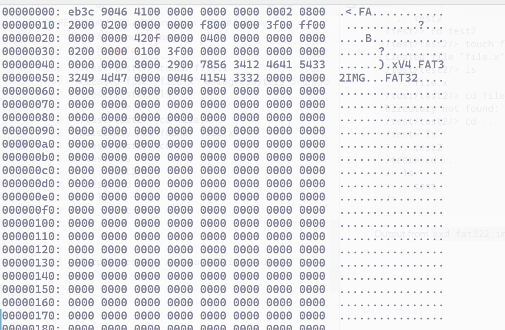

# FAT simulation

It is simplified version of FAT file system, skipped some details (such as FSInfo)

```
+-----------------------+ 
|   Reserved Region|  (BPB)
+-----------------------+
|   FAT1                      |  
+-----------------------+
|   FAT2 (copy)        |
+-----------------------+
|   Data Region         | (clusters)
+-----------------------+

```


To build:
```
make
```
To run:
```
./FATik <filename>
```
If file is not exist, FATik will create it in 2 MB size.

## Available comands

* ls - list files in FAT table;
* cd - change directory;
* format - format file;
* mkdir - create directory;
* exit - exit from FATik.

## Example

```
fallocate -l 2MB fat322.img
```
and then
```
./FATik fat322.img
```

```
/> ls
Unknown disk format
/> format
format
/> ls
. .. 
/> cd test
Directory not found: test
/> mkdir test
Created folder: test (cluster 3)
/> ls
. .. test 
/> cd test
/test/> ls
. .. 
/test/> mkdir test2
Created folder: test2 (cluster 4)
/test/> ls
. .. test2 
/test/> cd test2
/test/test2/> touch file.x
Created file "file.x" using clusters 5 and 5
/test/test2/> ls
. .. file.x 
/test/test2/> cd file.x
Directory not found: file.x
/test/test2/> cd ..
/test> ls
. .. test2 
/test> cd ..
/> ls
. .. test 
/> 
```

Output from ```xxd fat322.img | less```:

